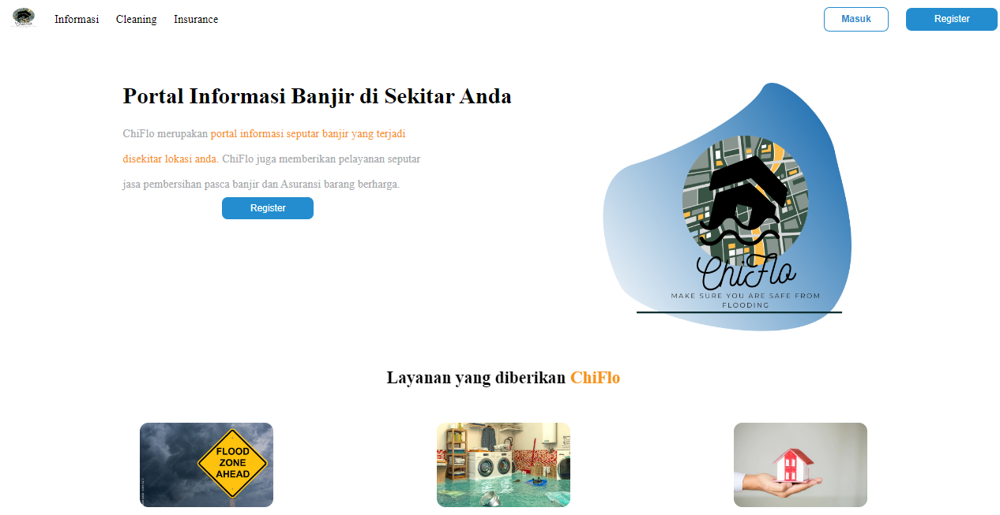

# Disaster Management Chi-Flo (Checking Flood)
ChiFlo is a disaster management application that can provide information about flooding around the user's location. In addition, ChiFlo has another business model, namely Property and Vehicle Insurance from various disasters. Another business model is Home and Property Cleaning Services, we specialize in post-flood cleaning.



## Feature

- In Information about Floods in locations around users
- Property and Vehicle Insurance due to various disasters
- Home and Property Cleaning Services, specializing in post-flood cleaning

## Powered by


- [Create React App](https://create-react-app.dev/) to initialize the project.
- [React Redux](https://react-redux.js.org/) to manage the app state.
- Hosted on [Vercel](https://vercel.com/).


## How to run on vercel
 - open with your browser https://chi-flo-generasi-gigih-2-0.vercel.app/
 

## How to run on local

- Clone this project

    ```bash
    git clone https://github.com/gabrillukita1/ChiFlo-GenerasiGIGIH2.0.git
    ```

- Go to the project folder

    ```bash
    cd sapitify-v2
    ```

- Install dependencies

    ```bash
    npm install
    ```


- Run the server

    ```bash
    npm start
    ```

- Open <http://localhost:3001> with your browser to see the result.


